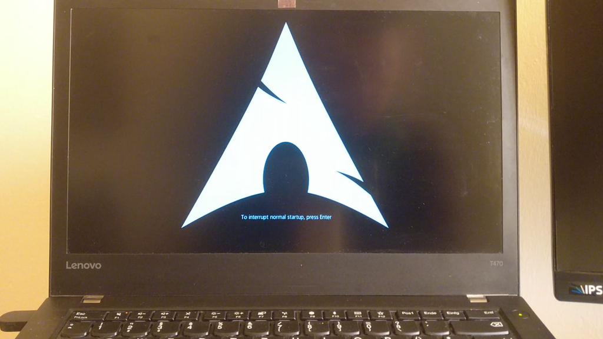

# Custom boot logo on a T470/T480/...
Source: [Reddit](https://www.reddit.com/r/thinkpad/comments/a57xhc/guide_custom_boot_logo_on_a_t480/)

### Make a BIOS update that contains the new logo 
- First we need the BIOS upadate utility ISO file from the [Lenovo site](https://pcsupport.lenovo.com/de/en/products/laptops-and-netbooks/thinkpad-t-series-laptops/thinkpad-t470/downloads#).  
Set your model and set the filter for components -> BIOS/UEFI.  
Go to the entry that says `(Utility & Bootable CD)` and download the `BIOS Update (Bootable CD)`
- Then extract the iso with `geteltorito -o bios.img n24ur09w.iso`
- And write it to a USB stick `sudo dd if=bios.img of=/dev/sdX bs=4M`
- Mount the stick and copy the image to `FLASH/LOGO.JPG`, `FLASH/LOGO.GIF`, or `FLASH/LOGO.BMP`
- If you already have the latest BIOS version installed, you'll need to turn off the BIOS setting for preventing downgrades, as it seems to also prevent re-flashing the same version.
- Boot from the stick and make the BIOS update

### Make a logo image
You can use [mine](arch_logo.jpg). I created it from the same logo as my plymout theme ([arch-beat
](https://github.com/nenad/arch-beat))  
It will look like that:

Or you can create your own with GIMP. The image gets displayed centered in the upper portion of the screen (see [Reddit post](https://www.reddit.com/r/thinkpad/comments/a57xhc/guide_custom_boot_logo_on_a_t480/) for more details)

- image has to be <60KB
- turn off "Progressive" and all of the "Save ___ data" checkboxes
- set the subsampling to 4:2:0
- "Optimize" can be enabled
- DCT method can be integer.