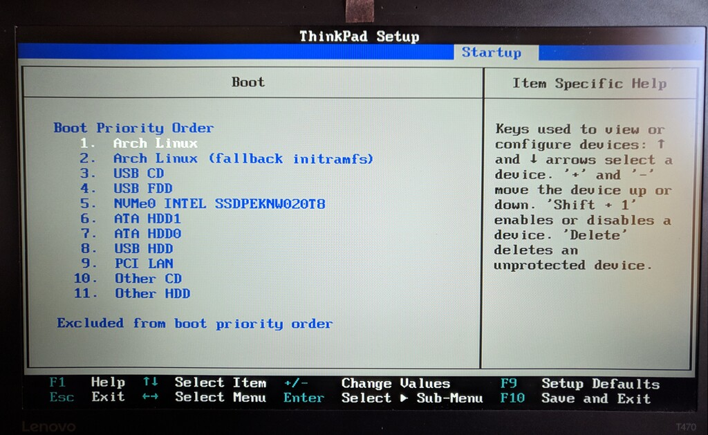
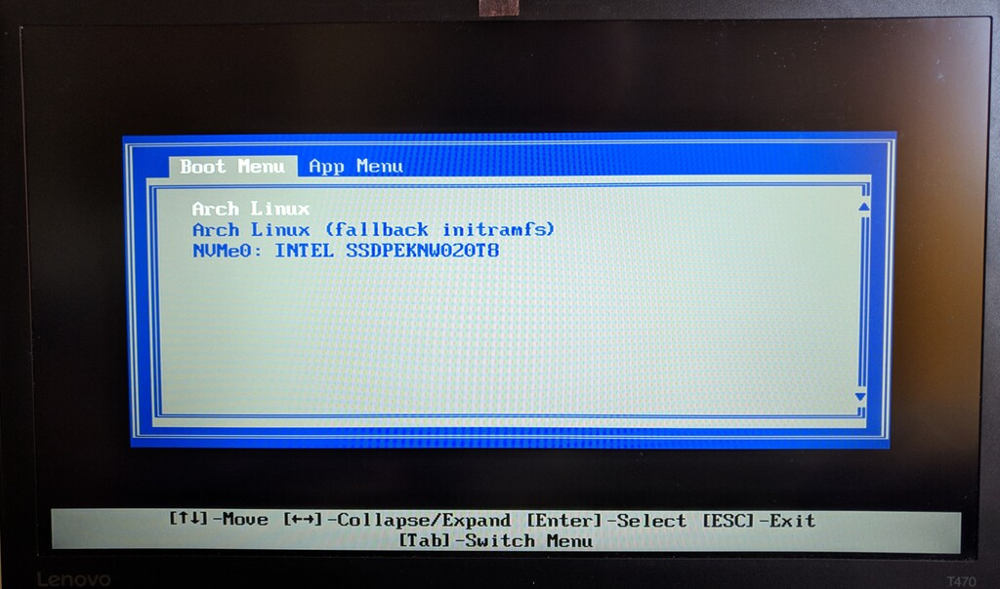

# UEFI boot without boot loader
## Some basics
There are multiple options to boot your system. 


Source: [Arch boot process](https://wiki.archlinux.org/index.php/Arch_boot_process#System_initialization)


#### Under BIOS

BIOS starts the first 440 bytes (the MBR boot code area) of the first disk in BIOS order.
The first stage of the boot loader in the boot code of the MBR, then starts the code of its second stage (if any) from: 
- next disk sectors after the MBR, i.e. the so called post-MBR gap (only on a MBR partition table).
- a partition's or a partitionless disk's volume boot record (VBR).
- the BIOS boot partition (GRUB on BIOS/GPT only).


#### Under UEFI
First the firmware reads the boot entries in the NVRAM to determine which EFI application to launch and from where (e.g. from which disk and partition).

- A boot entry could simply be a disk. In this case the firmware looks for an EFI system partition on that disk and tries to find an EFI application in the fallback boot path \EFI\BOOT\BOOTX64.EFI (BOOTIA32.EFI on systems with a IA32 (32-bit) UEFI). This is how UEFI bootable removable media work.

Then the firmware launches the EFI application.

- This could be a boot loader or the Arch kernel itself using EFISTUB.
- It could be some other EFI application such as a UEFI shell or a boot manager like systemd-boot or rEFInd.

### Conclusion
So under BIOS a boot loader was always needed. Under UEFI a boot loader is not needed but can be optionally used. Here i will show how to boot the kernel directly using EFISTUB.

## Requirements
### UEFI
First make sure that your system can boot with UEFI.  
You can check the existence of EFI variables to see if you have booted with UEFI with:
```
efivar --list
```
For UEFI boot it is mandatory to have an [EFI system partition (ESP)](https://wiki.archlinux.org/index.php/EFI_system_partition)

([Arch install guide with UEFI support (german)](https://wiki.archlinux.de/title/UEFI_Installation))

The english install guide just links to the ESP article.


## Set boot entry
Source [ArchWiki](https://wiki.archlinux.org/index.php/EFISTUB#Using_UEFI_directly)

In the ArchWiki there are descriped multiple ways of adding the boot entry. 
I had to do it from the [UEFI Shell](https://wiki.archlinux.org/index.php/EFISTUB#UEFI_Shell) because my boot process was a bit broken after a firmware upgrade but that's a different story...

The better and easier way is by using efibootmgr. It is just one command that looks like this: 
```
efibootmgr --disk /dev/sdX --part Y --create --label "Arch Linux" --loader /vmlinuz-linux --unicode 'root=PARTUUID=XXXXXXXX-XXXX-XXXX-XXXX-XXXXXXXXXXXX rw initrd=\initramfs-linux.img' --verbose
```
Make sure to use the correct disk and partition number. 
Then change the kernel parameters to what you had. Just look it up in `/boot/grub/grub.cfg` if you used Grub or try `cat /proc/cmdline`.

I have more parameters because I my disk is encrypted [(FDE)](https://wiki.archlinux.org/index.php/Dm-crypt/Encrypting_an_entire_system#Configuring_the_boot_loader_2) and I use [plymouth](https://wiki.archlinux.org/index.php/Plymouth#The_kernel_command_line). 
Also I want hibernation to work and the first initrd entry is for the [microcode](https://wiki.archlinux.org/index.php/Microcode#EFISTUB)

All in all the command looks like this for me:

```
sudo efibootmgr --disk /dev/nvme0n1 --part 1 --create --label "Arch Linux" --loader /vmlinuz-linux --unicode 'root=/dev/mapper/main-root rw cryptdevice=/dev/nvme0n1p2:cryptolvm quiet splash loglevel=3 rd.udev.log-priority=3 vt.global_cursor_default=0 resume=/dev/mapper/main-swap initrd=\intel-ucode.img initrd=\initramfs-linux.img' --verbose
```
I also tried `initrd=/IMGNAME.img` instead of `initrd=\IMGNAME.img` and it worked too.

And for the fallback initramfs I created a second entry:
```
sudo efibootmgr --disk /dev/nvme0n1 --part 1 --create --label "Arch Linux (fallback initramfs)" --loader /vmlinuz-linux --unicode 'root=/dev/mapper/main-root rw cryptdevice=/dev/nvme0n1p2:cryptolvm quiet splash loglevel=3 rd.udev.log-priority=3 vt.global_cursor_default=0 resume=/dev/mapper/main-swap initrd=\initramfs-linux-fallback.img' --verbose
```

Make sure the boot order is correct. You can set it with `sudo efibootmgr -o XXXX,YYYY,ZZZZ,...`

It should look like this then:


```
$ sudo efibootmgr
BootCurrent: 0001
Timeout: 0 seconds
BootOrder: 0001,0002,0017,0018,0019,001A,001B,001C,001D,001E,001F
Boot0001* Arch Linux
Boot0002* Arch Linux (fallback initramfs)
Boot0010  Setup
Boot0011  Boot Menu
Boot0012  Diagnostic Splash Screen
[...]

```

If for any reason the boot fails you can still boot by the old way. Just press F12 (Thinkpads) to get into the boot menu and select the harddisk.

## Images


*Boot order*


*Boot menu*